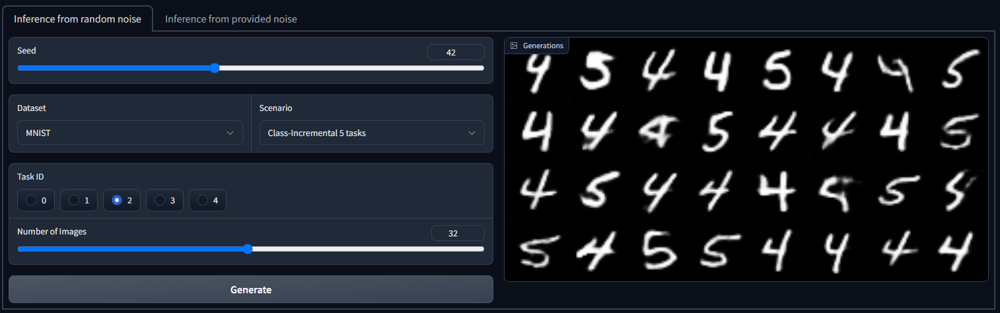
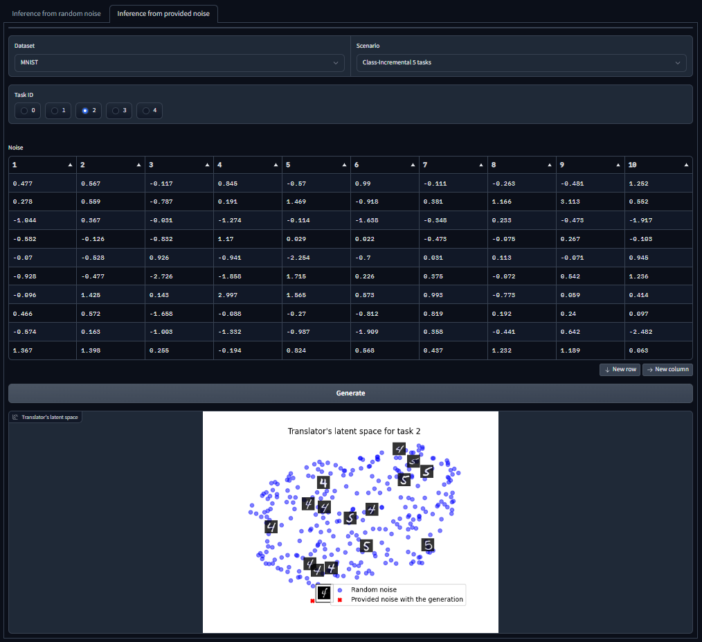

# Multiband GAN
[](https://arxiv.org/abs/2312.13699)

## Table of Contents

- [About](#about)
- [Getting started](#getting_started)
- [Experiments](#experiments)
- [Reproducing results](#reproducing)
- [Web Application](#app)
- [Credits](#credits)

## About <a name = "about"></a>

Multiband GAN is an adaptation of unsupervised method for continual learning of geneartive models called *multiband training*, introduced in [Multiband VAE](https://github.com/KamilDeja/multiband_vae), to the Generative Adversarial Networks architecture. To stabilize the training, instead of standard GAN architecture, we use WGAN with gradient penalty. We are able to outperform other known methods on the most popular continual learning benchmarks.


## Getting started <a name = "getting_started"></a>

### Prerequisites

To install this repository, you should have `Python` installed. This repository was tested under `Linux` and `Windows 10`.

### Installation

1. Clone repository and navigate to project's directory
```
$ git clone https://github.com/bartooo/multiband_gan.git
$ cd multiband_gan/
```
2. Create new virtual environment
```
$ python -m venv gan_venv
```
3. Activate created virtual environment:

Linux:
```
$ source gan_venv/bin/activate
```
Windows:
```
$ gan_venv\Scripts\activate
```
4. Install requirements from `requirements.txt` file
```
$ pip install -r requirements.txt
```

## Experiments <a name = "experiments"></a>

### Multiband VAE
CL Benchmark|Num. of tasks|FID $\downarrow$|Precision $\uparrow$| Recall $\uparrow$
:---:|:---:|:---:|:---:|:---:
Split-MNIST Class Incremental|5|23|92|98
MNIST Dirichlet $\alpha=1$|10|30|92|97
Split-FashionMNIST Class Incremental|5|56|65|72
FashionMNIST Dirichlet $\alpha=1$|10|77|58|69
Split-Omniglot Class Incremental|5|12|98|96
Split-Omniglot Class Incremental|20|24|95|91
Omniglot Dirichlet $\alpha=1$|20|24|96|91
FashionMNIST $\rightarrow$ MNIST Class Incremental|10|49|68|70
MNIST $\rightarrow$ FashionMNIST Class Incremental|10|49|70|70
Split-CelebA Class Incremental|5|95|28.5|23.2
CelebA Dirichlet $\alpha=1$|10|93|33|22
CelebA Dirichlet $\alpha=100$|10|89|36.2|28


### Multiband GAN
CL Benchmark|Num. of tasks|FID $\downarrow$|Precision $\uparrow$| Recall $\uparrow$
:---:|:---:|:---:|:---:|:---:
Split-MNIST Class Incremental|5|9|99|99
MNIST Dirichlet $\alpha=1$|10|20|98|98
Split-FashionMNIST Class Incremental|5|34|92|92
FashionMNIST Dirichlet $\alpha=1$|10|58|88|83
Split-Omniglot Class Incremental|5|1|99|98
Split-Omniglot Class Incremental|20|3|96|95
Omniglot Dirichlet $\alpha=1$|20|4|96|93
FashionMNIST $\rightarrow$ MNIST Class Incremental|10|31|89|87
MNIST $\rightarrow$ FashionMNIST Class Incremental|10|26|93|91
Split-CelebA Class Incremental|5|39|81|79
CelebA Dirichlet $\alpha=1$|10|60|67|67
CelebA Dirichlet $\alpha=100$|10|37|80|83
Split-CIFAR10 Class Incremental|5|43|92|79
Split-CIFAR100 Class Incremental|20|144|77|52

## Reproducing results <a name = "reproducing"></a>
1. Split-MNIST Class Incremental 5 tasks
```
python3 main.py --wandb_project MultibandGAN --experiment_name CI_5 --dataset MNIST --gpuid 0 --seed 42 --num_batches 5 --latent_dim 100 --batch_size 64 --score_on_val --num_local_epochs 120 --num_global_epochs 200 --local_dis_lr 0.0002 --local_gen_lr 0.0002 --local_scheduler_rate 0.99 --lambda_gp 10 --num_gen_images 64 --local_b1 0.0 --local_b2 0.9 --global_gen_lr 0.001 --optim_noise_lr 0.1 --global_scheduler_rate 0.99 --limit_previous 0.5 --d_n_features 32 --g_n_features 32 --global_warmup 5 --only_generations
```

2. MNIST Dirichlet $\alpha=1$ 10 tasks
```
python3 main.py --wandb_project MultibandGAN --experiment_name Dirichlet_alpha_1_10 --dataset MNIST --gpuid 0 --seed 42 --num_batches 10 --latent_dim 100 --batch_size 64 --score_on_val --num_local_epochs 120 --num_global_epochs 200 --local_dis_lr 0.0002 --local_gen_lr 0.0002 --local_scheduler_rate 0.99 --lambda_gp 10 --num_gen_images 64 --local_b1 0.0 --local_b2 0.9 --global_gen_lr 0.001 --optim_noise_lr 0.1 --global_scheduler_rate 0.99 --limit_previous 0.5 --d_n_features 32 --g_n_features 32 --dirichlet 1 --global_warmup 5 --only_generations
```

3. Split-FashionMNIST Class Incremental 5 tasks
```
python3 main.py --wandb_project MultibandGAN --experiment_name CI_5 --dataset FashionMNIST --gpuid 0 --seed 42 --num_batches 5 --latent_dim 100 --batch_size 64 --score_on_val --num_local_epochs 120 --num_global_epochs 200 --local_dis_lr 0.0002 --local_gen_lr 0.0002 --local_scheduler_rate 0.99 --lambda_gp 10 --num_gen_images 64 --local_b1 0.0 --local_b2 0.9 --global_gen_lr 0.001 --optim_noise_lr 0.1 --global_scheduler_rate 0.99 --limit_previous 0.5 --d_n_features 32 --g_n_features 32 --global_warmup 5 --only_generations
```

4. FashionMNIST Dirichlet $\alpha=1$ 10 tasks
```
python3 main.py --wandb_project MultibandGAN --experiment_name Dirichlet_alpha_1_10 --dataset FashionMNIST --gpuid 0 --seed 42 --num_batches 10 --latent_dim 100 --batch_size 64 --score_on_val --num_local_epochs 120 --num_global_epochs 200 --local_dis_lr 0.0002 --local_gen_lr 0.0002 --local_scheduler_rate 0.99 --lambda_gp 10 --num_gen_images 64 --local_b1 0.0 --local_b2 0.9 --global_gen_lr 0.001 --optim_noise_lr 0.1 --global_scheduler_rate 0.99 --limit_previous 0.5 --d_n_features 32 --g_n_features 32 --dirichlet 1 --global_warmup 5 --only_generations
```

5. Split-Omniglot Class Incremental 5 tasks
```
python3 main.py --wandb_project MultibandGAN --experiment_name CI_5 --dataset Omniglot --gpuid 0 --seed 42 --num_batches 5 --latent_dim 100 --batch_size 64 --score_on_val --num_local_epochs 120 --num_global_epochs 200 --local_dis_lr 0.0002 --local_gen_lr 0.0002 --local_scheduler_rate 0.99 --lambda_gp 10 --num_gen_images 64 --local_b1 0.0 --local_b2 0.9 --global_gen_lr 0.001 --optim_noise_lr 0.1 --global_scheduler_rate 0.99 --limit_previous 0.5 --d_n_features 32 --g_n_features 32 --global_warmup 5 --only_generations
```

6. Split-Omniglot Class Incremental 20 tasks
```
python3 main.py --wandb_project MultibandGAN --experiment_name CI_20 --dataset Omniglot --gpuid 0 --seed 42 --num_batches 20 --latent_dim 100 --batch_size 64 --score_on_val --num_local_epochs 120 --num_global_epochs 200 --local_dis_lr 0.0002 --local_gen_lr 0.0002 --local_scheduler_rate 0.99 --lambda_gp 10 --num_gen_images 64 --local_b1 0.0 --local_b2 0.9 --global_gen_lr 0.001 --optim_noise_lr 0.1 --global_scheduler_rate 0.99 --limit_previous 0.5 --d_n_features 32 --g_n_features 32 --global_warmup 5 --only_generations
```

7. Omniglot Dirichlet $\alpha=1$ 20 tasks
```
python3 main.py --wandb_project MultibandGAN --experiment_name Dirichlet_alpha_1_20 --dataset Omniglot --gpuid 0 --seed 42 --num_batches 20 --latent_dim 100 --batch_size 64 --score_on_val --num_local_epochs 120 --num_global_epochs 200 --local_dis_lr 0.0002 --local_gen_lr 0.0002 --local_scheduler_rate 0.99 --lambda_gp 10 --num_gen_images 64 --local_b1 0.0 --local_b2 0.9 --global_gen_lr 0.001 --optim_noise_lr 0.1 --global_scheduler_rate 0.99 --limit_previous 0.5 --d_n_features 32 --g_n_features 32 --global_warmup 5 --dirichlet 1 --only_generations
```

8. FashionMNIST $\rightarrow$ MNIST Class Incremental 10 tasks
```
python3 main.py --wandb_project MultibandGAN --experiment_name CI_10 --dataset DoubleMNIST --gpuid 0 --seed 42 --num_batches 10 --latent_dim 100 --batch_size 64 --score_on_val --num_local_epochs 120 --num_global_epochs 200 --local_dis_lr 0.0002 --local_gen_lr 0.0002 --local_scheduler_rate 0.99 --lambda_gp 10 --num_gen_images 64 --local_b1 0.0 --local_b2 0.9 --global_gen_lr 0.001 --optim_noise_lr 0.1 --global_scheduler_rate 0.99 --limit_previous 0.5 --d_n_features 32 --g_n_features 32 --global_warmup 5 --only_generations
```

9. MNIST $\rightarrow$ FashionMNIST Class Incremental 10 tasks
```
python3 main.py --wandb_project MultibandGAN --experiment_name CI_10_reverse --dataset DoubleMNIST --gpuid 0 --seed 42 --num_batches 10 --latent_dim 100 --batch_size 64 --score_on_val --num_local_epochs 120 --num_global_epochs 200 --local_dis_lr 0.0002 --local_gen_lr 0.0002 --local_scheduler_rate 0.99 --lambda_gp 10 --num_gen_images 64 --local_b1 0.0 --local_b2 0.9 --global_gen_lr 0.001 --optim_noise_lr 0.1 --global_scheduler_rate 0.99 --limit_previous 0.5 --d_n_features 32 --g_n_features 32 --global_warmup 5 --reverse --only_generations
```

10. Split-CelebA Class Incremental 5 tasks
```
python3 main.py --wandb_project MultibandGAN --experiment_name CI_5 --dataset CelebA --gpuid 0 --seed 42 --num_batches 5 --latent_dim 100 --batch_size 64 --score_on_val --num_local_epochs 120 --num_global_epochs 200 --local_dis_lr 0.0002 --local_gen_lr 0.0002 --local_scheduler_rate 0.99 --lambda_gp 10 --num_gen_images 64 --local_b1 0.0 --local_b2 0.9 --global_gen_lr 0.001 --optim_noise_lr 0.1 --global_scheduler_rate 0.99 --limit_previous 0.5 --d_n_features 50 --g_n_features 50 --global_warmup 5 --only_generations
```

11. CelebA Dirichlet $\alpha=1$ 10 tasks
```
python3 main.py --wandb_project MultibandGAN --experiment_name Dirichlet_alpha_1_10 --dataset CelebA --gpuid 0 --seed 42 --num_batches 10 --latent_dim 100 --batch_size 64 --score_on_val --num_local_epochs 120 --num_global_epochs 200 --local_dis_lr 0.0002 --local_gen_lr 0.0002 --local_scheduler_rate 0.99 --lambda_gp 10 --num_gen_images 64 --local_b1 0.0 --local_b2 0.9 --global_gen_lr 0.001 --optim_noise_lr 0.1 --global_scheduler_rate 0.99 --limit_previous 0.5 --d_n_features 50 --g_n_features 50 --global_warmup 5 --dirichlet 1 --only_generations
```

12. CelebA Dirichlet $\alpha=100$ 10 tasks
```
python3 main.py --wandb_project MultibandGAN --experiment_name Dirichlet_alpha_100_10 --dataset CelebA --gpuid 0 --seed 42 --num_batches 10 --latent_dim 100 --batch_size 64 --score_on_val --num_local_epochs 120 --num_global_epochs 200 --local_dis_lr 0.0002 --local_gen_lr 0.0002 --local_scheduler_rate 0.99 --lambda_gp 10 --num_gen_images 64 --local_b1 0.0 --local_b2 0.9 --global_gen_lr 0.001 --optim_noise_lr 0.1 --global_scheduler_rate 0.99 --limit_previous 0.5 --d_n_features 50 --g_n_features 50 --global_warmup 5 --dirichlet 100 --only_generations
```

13. Split-CIFAR10 Class Incremental 5 tasks
```
python3 main.py --wandb_project MultibandGAN --experiment_name CI_5 --dataset CIFAR10 --gpuid 0 --seed 42 --num_batches 5 --latent_dim 100 --batch_size 64 --score_on_val --num_local_epochs 120 --num_global_epochs 200 --local_dis_lr 0.0002 --local_gen_lr 0.0002 --local_scheduler_rate 0.99 --lambda_gp 10 --num_gen_images 64 --local_b1 0.0 --local_b2 0.9 --global_gen_lr 0.001 --optim_noise_lr 0.1 --global_scheduler_rate 0.99 --limit_previous 0.5 --d_n_features 128 --g_n_features 128 --global_warmup 5 --only_generations
```

14. Split-CIFAR100 Class Incremental 20 tasks
```
python3 main.py --wandb_project MultibandGAN --experiment_name CI_20 --dataset CIFAR100 --gpuid 0 --seed 42 --num_batches 20 --latent_dim 100 --batch_size 64 --score_on_val --num_local_epochs 120 --num_global_epochs 200 --local_dis_lr 0.0002 --local_gen_lr 0.0002 --local_scheduler_rate 0.99 --lambda_gp 10 --num_gen_images 64 --local_b1 0.0 --local_b2 0.9 --global_gen_lr 0.001 --optim_noise_lr 0.1 --global_scheduler_rate 0.99 --limit_previous 0.5 --d_n_features 128 --g_n_features 128 --global_warmup 5 --only_generations
```

15. CERN Class Incremental 5 tasks
```
python3 main.py --wandb_project MultibandGAN --experiment_name Class-Incremental_5_tasks --dataset CERN --gpuid 0 --seed 42 --num_batches 5 --latent_dim 100 --batch_size 64 --score_on_val --num_local_epochs 120 --num_global_epochs 200 --local_dis_lr 0.0002 --local_gen_lr 0.0002 --local_scheduler_rate 0.99 --lambda_gp 10 --num_gen_images 64 --local_b1 0.0 --local_b2 0.9 --global_gen_lr 0.001 --optim_noise_lr 0.1 --global_scheduler_rate 0.99 --limit_previous 0.5 --d_n_features 32 --g_n_features 32 --global_warmup 5 --only_generations
```

## Application <a name = "app"></a>

### Installation and running
NOTE: `Gradio` package works from `Python 3.7` version.

1. Navigate to app's directory
```
$ cd app/
```
2. Create new virtual environment
```
$ python -m venv app_venv
```
3. Activate created virtual environment:

Linux:
```
$ source app_venv/bin/activate
```
Windows:
```
$ app_venv\Scripts\activate
```
4. Install requirements from `requirements.txt` file
```
$ pip install -r requirements.txt
```

Then, to run the application just run a `demo.py` file
```
python demo.py
```


### Inference from random noise
Under the "Inference from random noise" tab, we can
visualize the generations of the model trained according to the specific CL scenario and
on a specific dataset. The generator takes as input a random noise vector.


### Inference from provided noise
The "Inference from provided noise" tab is similar to the
previously presented tab, except that now we can control the values of the input vector.
The user provides the value of each element of that vector in the matrix. s a
generation result, we now get the generation itself and the visualization of the translator’s
latent space.




## Credits <a name = "credits"></a>
Repository based on [Continual-Learning-Benchmark](https://github.com/GT-RIPL/Continual-Learning-Benchmark) and [Multiband VAE](https://github.com/KamilDeja/multiband_vae).
